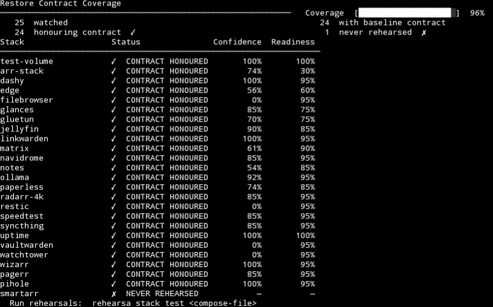

# Rehearsa

> **Backups are hope. Rehearsa is proof.**

Rehearsa is a restore rehearsal engine for Docker-based self-hosted
environments.\
It validates that your docker-compose stacks can actually boot ---
before disaster happens.



------------------------------------------------------------------------

## Why Rehearsa Exists

Most self-hosters run automated backups. Almost nobody tests restores.

When disaster strikes: - Volumes are missing - Databases fail to start -
Permissions are wrong - Images are unavailable - Dependencies boot in
the wrong order

A backup succeeding does not mean a restore will succeed.

Rehearsa exists to close that gap.

------------------------------------------------------------------------

## Quick Start

``` bash
# Test a stack
rehearsa --timeout 120 stack test docker-compose.yml

# View fleet status
rehearsa status
```

------------------------------------------------------------------------

## What Rehearsa Does (v0.1.0)

Rehearsa performs a controlled stack simulation based on a
docker-compose file:

-   Parses the Compose file and resolves service dependency order
-   Creates an isolated temporary Docker network
-   Pulls images based on policy
-   Boots services in dependency order
-   Waits for container health and running state
-   Scores each service and calculates stack confidence, risk, and
    stability
-   Cleans up everything --- containers and network

**No changes are made to your live stack.**

------------------------------------------------------------------------

## Core Principle

Rehearsa is not a backup tool. It is a restore validation engine.

It answers one critical question:

> If I had to rebuild this stack on a fresh host right now --- would it
> actually boot?

------------------------------------------------------------------------

## Scoring Model

  State                          Score
  ------------------------------ -------
  HEALTHY (healthcheck passed)   100
  RUNNING (no healthcheck)       85
  UNHEALTHY                      40
  EXITED / failed                0

Stack confidence is the average of all service scores, aggregated into a
risk band:

  Confidence   Risk
  ------------ ----------
  90--100%     LOW
  70--89%      MODERATE
  40--69%      HIGH
  0--39%       CRITICAL

Rehearsa also tracks:

-   Regression trends (UP / DOWN / SAME)
-   Rolling stability across the last 5 runs
-   Duration spikes
-   Policy violations

------------------------------------------------------------------------

## Policy Engine

Enforce restore standards per stack:

``` bash
rehearsa policy set mystack \
  --min-confidence 80 \
  --block-on-regression true \
  --fail-on-duration-spike true \
  --duration-spike-percent 40
```

Policy violations produce non-zero exit codes --- making Rehearsa CI/CD
compatible.

------------------------------------------------------------------------

## Strict Integrity Mode

Rehearsa signs every run record with a SHA-256 hash.\
In strict mode, any tampered or corrupted history file will block
execution --- providing a tamper-evident audit trail.

``` bash
rehearsa --strict-integrity stack test docker-compose.yml
```

------------------------------------------------------------------------

## History and Trend Tracking

``` bash
rehearsa history show mystack
```

Example output:

    Stack: mystack

    2026-02-21T12:39:45+00:00 | Confidence: 100% | Risk: LOW | Duration: 13s | Exit: 0
    2026-02-21T14:02:11+00:00 | Confidence: 78%  | Risk: MODERATE | Duration: 15s | Exit: 0

------------------------------------------------------------------------

## Design Goals

-   Agentless --- Docker socket only
-   Fully isolated network simulation
-   No modification of live containers
-   Deterministic cleanup
-   Clear scoring and trend visibility
-   CI-friendly exit codes
-   Single static binary
-   Written in Rust

------------------------------------------------------------------------

## What Rehearsa Is Not

-   Not a backup tool
-   Not a monitoring tool
-   Not a container orchestrator
-   Not a live migration system

It does one thing:

**Validate whether your stack would successfully restore.**

------------------------------------------------------------------------

## Roadmap

-   [ ] Volume validation and mount inspection
-   [ ] Network mapping verification
-   [ ] Cross-host restore simulation
-   [ ] Backup provider hooks (Restic, Borg)
-   [ ] Weighted reliability scoring
-   [ ] Failure injection / chaos mode

------------------------------------------------------------------------

## Installation

### Pre-built binary (x86_64)

``` bash
curl -L https://github.com/rehearsa/rehearsa/releases/latest/download/rehearsa-x86_64 -o rehearsa
chmod +x rehearsa
sudo mv rehearsa /usr/local/bin/
```

### ARM (Raspberry Pi and similar)

``` bash
curl -L https://github.com/rehearsa/rehearsa/releases/latest/download/rehearsa-aarch64 -o rehearsa
chmod +x rehearsa
sudo mv rehearsa /usr/local/bin/
```

### Build from source

``` bash
git clone https://github.com/rehearsa/rehearsa
cd rehearsa
cargo build --release
```

Requires Rust 1.75+ and Docker.

------------------------------------------------------------------------

## Contributing

Rehearsa is actively evolving.\
If you would like to contribute, open an issue to discuss scope and
architectural alignment first.

------------------------------------------------------------------------

## License

MIT --- see LICENSE

------------------------------------------------------------------------

*If you're not rehearsing your restores, you don't have backups. You
have hopes.*
